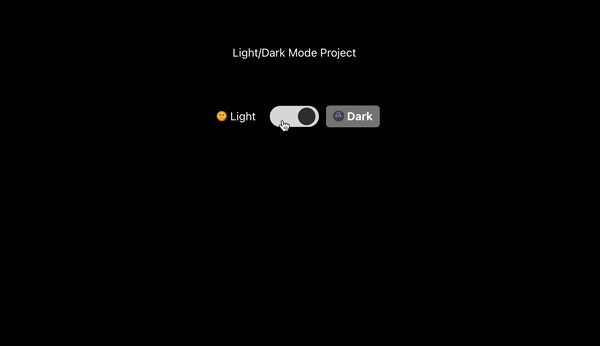

# DarkMode-Toggle-Project

DarkMode Toggle Project

We will be creating Custom Hook to store our current Theme in Local Storage so when page getting refreshed the saved current theme doesn’t get lost

useLocalStorage.jsx

import { useEffect, useState } from "react";

export default function useLocalStorage(key, defaultValue) {
    
  // Initialize the state with the value from localStorage or defaultValue
  const [value, setValue] = useState(() => {
    let currentValue;

    try {
      currentValue = JSON.parse(
        localStorage.getItem(key) || String(defaultValue)
      );
    } catch (error) {
      console.log(error);
      currentValue = defaultValue;
    }
    return currentValue;
  });

  // storing the theme value in Local Storage and to update localStorage whenever state changes
  useEffect(() => {
    localStorage.setItem(key, JSON.stringify(value));
  }, [key, value]);

  // Return the state value and the setter function
  return [value, setValue];
}

index.jsx

import React from "react";
import "./styles.css";
import useLocalStorage from "./useLocalStorage";

export default function DarkModeToggle() {
  const [theme, setTheme] = useLocalStorage("theme", "dark");

  function handleToggleTheme() {
    setTheme(theme === "light" ? "dark" : "light");
  }

  function handleSetLightTheme() {
    setTheme("light");
  }

  function handleSetDarkTheme() {
    setTheme("dark");
  }

  return (
    

      

        
Light/Dark Mode Project

        

          

            🌞 Light
          

          

            

          

          

            🌚 Dark
          

        

      

    

  );
}

styles.css
.light-dark-mode {
  display: flex;
  flex-direction: column;
  justify-content: center;
  align-items: center;
}
.projectHeader {
  padding-top: 50px;
}
.light-dark-mode[data-theme="light"] {
  background-color: white;
  color: black;
}

.light-dark-mode[data-theme="dark"] {
  background-color: black;
  color: white;
}

/* Container for the switch and labels */
.theme-switch-container {
  display: flex;
  padding-top: 50px;
  padding-bottom: 500px;
  align-items: center;
  justify-content: center;
}

/* Styles for the theme switch */
.theme-switch {
  display: inline-block;
  cursor: pointer;
  border-radius: 50px;
  background-color: #ddd;
  position: relative;
  width: 70px;
  height: 30px;
  margin: 0 10px;
}

/* Styles for the switch icon */
.switch-icon {
  height: 25px;
  width: 25px;
  background-color: white;
  border-radius: 50%;
  position: absolute;
  top: 2.5px;
  transition: left 0.3s ease;
}

.switch-icon.light {
  left: 5px;
  background-color: rgb(243, 243, 240);
}

.switch-icon.dark {
  left: 40px;
  background-color: rgb(54, 54, 54);
}

/* Styles for light and dark text */
.toggler--light,
.toggler--dark {
  font-size: 1rem;
  display: flex;
  align-items: center;
  cursor: pointer;
  padding: 5px 10px;
  border-radius: 5px;
  transition: background-color 0.3s ease, color 0.3s ease;
}

.toggler--light:hover,
.toggler--dark:hover {
  background-color: rgba(0, 0, 0, 0.1);
}

.toggler--light.active {
  background-color: rgb(234, 234, 226);
  color: black;
  font-weight: bold;
}

.toggler--dark.active {
  background-color: gray;
  color: white;
  font-weight: bold;
}

so what we did here

useLocalStorage.js
This custom hook manages state that is synchronized with localStorage. This allows the theme preference to persist across page reloads.
The useLocalStorage hook takes a key and a defaultValue.
It initializes the state using useState. The initial state is derived from localStorage if it exists, or the defaultValue.
The useEffect hook is used to update localStorage whenever the state changes.
It returns the state value and a setter function, just like the useState hook.

DarkModeToggle.js
The component provides a toggle for switching between light and dark modes, storing the preference in localStorage.
useLocalStorage("theme", "dark") is used to manage the theme state, defaulting to "dark".
handleToggleTheme, handleSetLightTheme, and handleSetDarkTheme are functions to change the theme state.
handleToggleTheme toggles the theme between "light" and "dark".
handleSetLightTheme sets the theme to "light".
handleSetDarkTheme sets the theme to "dark".
The return statement renders the UI:
The div with className="light-dark-mode" has a data-theme attribute that dynamically sets the theme class based on the current state.
Inside the container, there is a header and a switch for toggling the theme.
The switch consists of two clickable divs representing "Light" and "Dark" themes and a central switch icon that toggles the theme when clicked.
The theme-specific classes (active, light, dark) are applied based on the current theme state to provide visual feedback.

CSS Style
The .light-dark-mode class styles the container to fill the entire viewport and centers its content.
Conditional styling for the data-theme attribute sets the background and text colors for light and dark themes.
The .theme-switch-container uses Flexbox to align and center the switch and labels.
The .theme-switch class styles the switch container with a rounded shape, positioning the switch icon relative to it.
The .switch-icon class styles the switch icon itself, changing its position and background color based on the theme.
The .toggler--light and .toggler--dark classes style the clickable text elements, with hover effects and active states indicating the current theme.
